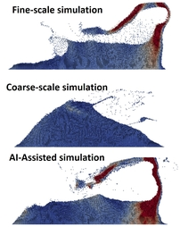
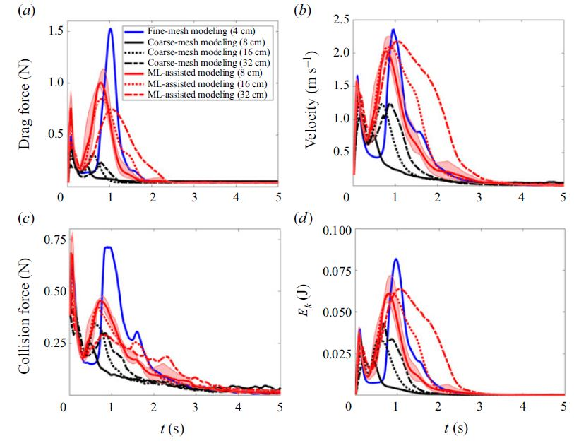

# MachineLearning-CFD-DEM

This repository provides an implementation for integrating pretrained Artificial Neural Networks (ANNs) into CFD-DEM simulations to predict drag forces during runtime. The approach enables high-fidelity modeling of fluid-particle interactions, leveraging machine learning to enhance the accuracy of coarse mesh simulations by learning from fine mesh data.

## Overview

Traditional CFD-DEM simulations rely on empirical drag models, such as Di Felice and Koch-Hill, which may not capture complex fluid-particle interactions at coarse resolutions. This codebase introduces a machine learning-assisted workflow, where ANNs trained on high-resolution data are used to predict drag forces, improving the physical fidelity of coarse-scale simulations.

The methodology and results are described in detail in our publication:

**High-resolution fluid–particle interactions: a machine learning approach**  
Journal of Fluid Mechanics  
[Read the paper](https://www.cambridge.org/core/journals/journal-of-fluid-mechanics/article/highresolution-fluidparticle-interactions-a-machine-learning-approach/6C80409A3FA5427BDF3ADF1B26EFB224)

## Features

- **Runtime ANN Drag Prediction:** Integrates pretrained neural networks to predict drag forces for each particle during simulation.
- **Model Training Flexibility:** ANNs can be trained on fine mesh cases and deployed for coarse mesh modeling.
- **Base Drag Models:** Includes implementations of Di Felice and Koch-Hill drag laws for benchmarking and comparison.
- **OpenFOAM & LIGGGHTS Coupling:** Designed for use within the CFDEMproject framework, enabling coupled CFD-DEM simulations.
- **Uncertainty Quantification:** Supports analysis of model uncertainty due to ANN initialization and training variability.

## Repository Structure

```
Paper.pdf                # Published manuscript (JFM)
README.md                # Project documentation
DiFeliceDrag_NN/         # Di Felice drag model with ANN integration
    DiFeliceDrag_NN.C
    DiFeliceDrag_NN.H
KochHillDrag_NN/         # Koch-Hill drag model with ANN integration
    KochHillDrag_NN.C
    KochHillDrag_NN.H
figures/                 # Figures for documentation and publication
    abstract.jpg
    results.JPG
```

## Getting Started

### Prerequisites

- [OpenFOAM](https://openfoam.org/) (CFD solver)
- [LIGGGHTS](https://www.cfdem.com/liggghts-open-source-discrete-element-method-particle-simulation-code) (DEM solver)
- [CFDEMproject](https://github.com/CFDEMproject/CFDEMcoupling-PUBLIC) (CFD-DEM coupling)
- C++ compiler supporting C++14 or newer

### Installation

1. Clone this repository and place the drag model folders (`DiFeliceDrag_NN`, `KochHillDrag_NN`) into your CFDEMproject source tree.
2. Compile the code using the standard OpenFOAM wmake build system.

### Usage

- **Training:** Train your ANN model using high-resolution CFD-DEM data. Export the trained model in the required binary format.
- **Simulation:** Specify the ANN model file in your simulation dictionary. During runtime, the drag force for each particle will be predicted using the ANN.
- **Analysis:** Use the provided probe and output fields to analyze drag, velocity, collision force, and kinetic energy evolution.

## Example Results





*Figure: Uncertainty quantification of the ML model for predicting (a) drag force, (b) particle velocity, (c) collision force, and (d) kinetic energy evolution. The pink region shows fluctuations due to different ANN initializations; the solid red curve is the average.*

## References

- Di Felice, R. (1994). The voidage function for fluid-particle interaction systems. *International Journal of Multiphase Flow*, 20(1), 153-159.
- Hill, R.J., Koch, D.L., & Ladd, A.J.C. (2001). Moderate-Reynolds-Number Flows in Ordered and Random Arrays of Spheres. *Journal of Fluid Mechanics*, 448, 243-278.

## License

This code is distributed under the GNU General Public License v3.0. See the LICENSE file for details.

## Acknowledgements

Developed as part of the CFDEMproject by Christoph Goniva and contributors.  
For questions and support, please refer to the [CFDEMproject community](https://www.cfdem.com/).

---